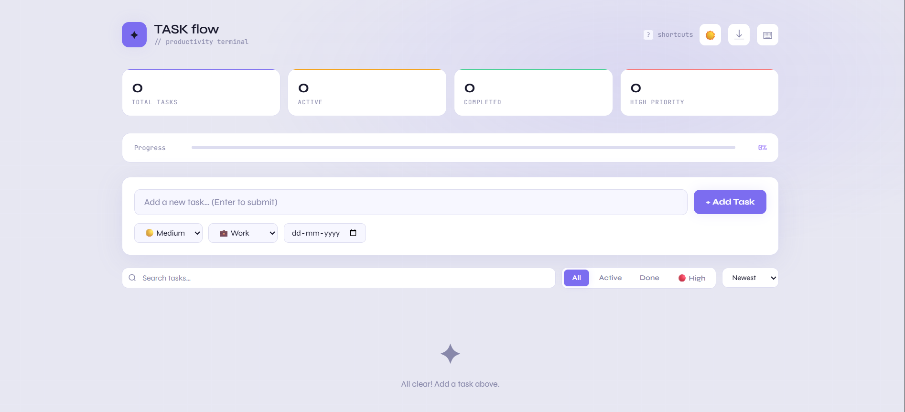
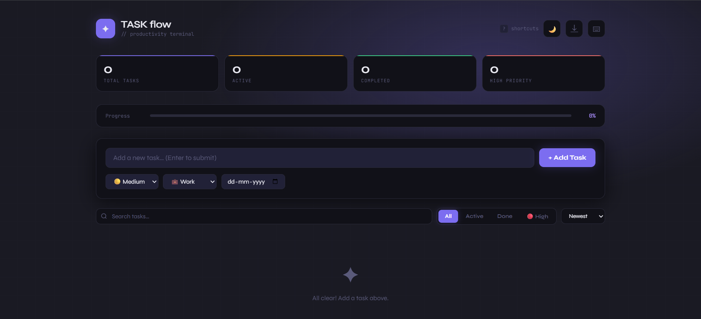
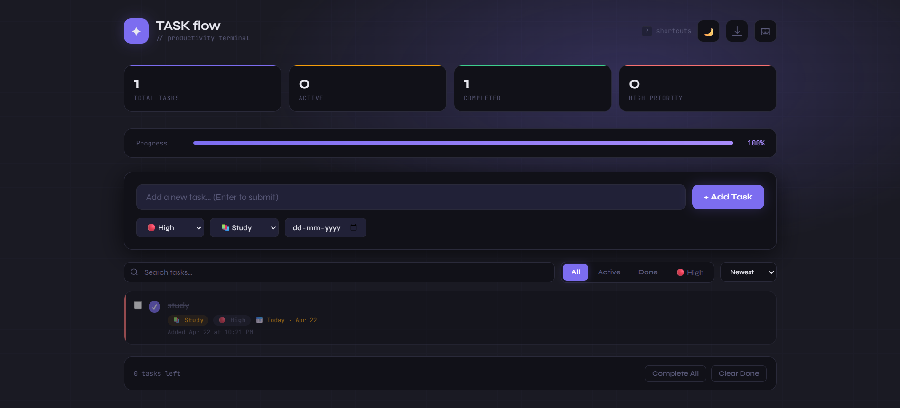

# TASKFLOW — Modern TODO Task Manager

A clean, fast, and feature-rich **Task Management Web App** built using **HTML, CSS, and JavaScript**.
Designed to improve productivity with smart features like filtering, search, progress tracking, and keyboard shortcuts.

---

## Features

### Core Features

* Add, edit, and delete tasks
* Mark tasks as complete / incomplete
* Task priority (Low, Medium, High)
* Categories (Work, Personal, Study, Health, Other)
* Due date support

---

### ⚡ Smart Features

* 🔍 Search tasks instantly
* 🎯 Filter (All / Active / Completed / High Priority)
* 📊 Sort tasks (Newest, Oldest, Priority, Due Date, A-Z)
* 📈 Progress bar (completion percentage)
* 📊 Live statistics (Total, Active, Completed, High Priority)

---

### Advanced Features

* 📦 Bulk actions (Complete / Undo / Delete multiple tasks)
* 🌙 Dark / Light theme toggle (with persistence)
* 💾 Local Storage (data saved automatically)
* ⌨️ Keyboard shortcuts for fast workflow
* 📤 Export tasks as JSON
* 🔔 Toast notifications

---

## Keyboard Shortcuts

| Action          | Shortcut         |
| --------------- | ---------------- |
| Add task        | Enter            |
| Focus input     | Ctrl + N         |
| Search          | Ctrl + F         |
| Toggle theme    | Ctrl + D         |
| Export tasks    | Ctrl + E         |
| Complete all    | Ctrl + A         |
| Clear completed | Ctrl + Backspace |
| Open shortcuts  | ?                |
| Close modal     | Esc              |

---

## 📸 Preview

### 🏠 Main UI


### 🌙 Dark Mode


### 📊 Stats & Progress


---

## 🛠 Tech Stack

* HTML5
* CSS3 (Modern UI + Variables + Animations)
* JavaScript
* LocalStorage

---

## 📂 Project Structure

```bash
taskflow/
│── index.html
│── style.css
│── script.js
│── README.md
```

---

## Getting Started

### Clone the repository

```bash
git clone https://github.com/deveshgi/todo-app
```

### Open project

```bash
cd taskflow
```

### Run

Just open `index.html` in your browser

---

## 🌐 Live Demo 

👉 https://your-username.github.io/taskflow

---

## 📌 Future Improvements

* ⚛️ Convert to React (Component-based architecture)
* 🌐 Add backend (Node.js + Express + MongoDB)
* 🔐 User authentication system
* ☁️ Cloud sync (multi-device support)
* 📱 Mobile app version

---

## 🧠 What I Learned

* DOM manipulation
* Event handling
* State management (without frameworks)
* Local storage usage
* UI/UX design fundamentals
* Writing clean and modular JavaScript

---

## 🙋‍♂️ Author

**Devesh Kumar**

* GitHub: https://github.com/your-username

---

## ⭐ Support

If you like this project:

👉 Give it a **star ⭐**
👉 Share it with others

---

## 📈 Goal

This is my **first GitHub project**, built with a focus on:

* Consistency 📅
* Learning 📚
* Real-world development 💻

---

### 🔥 "Consistency beats perfection."
